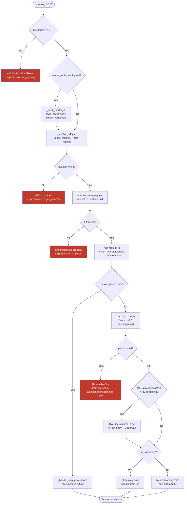
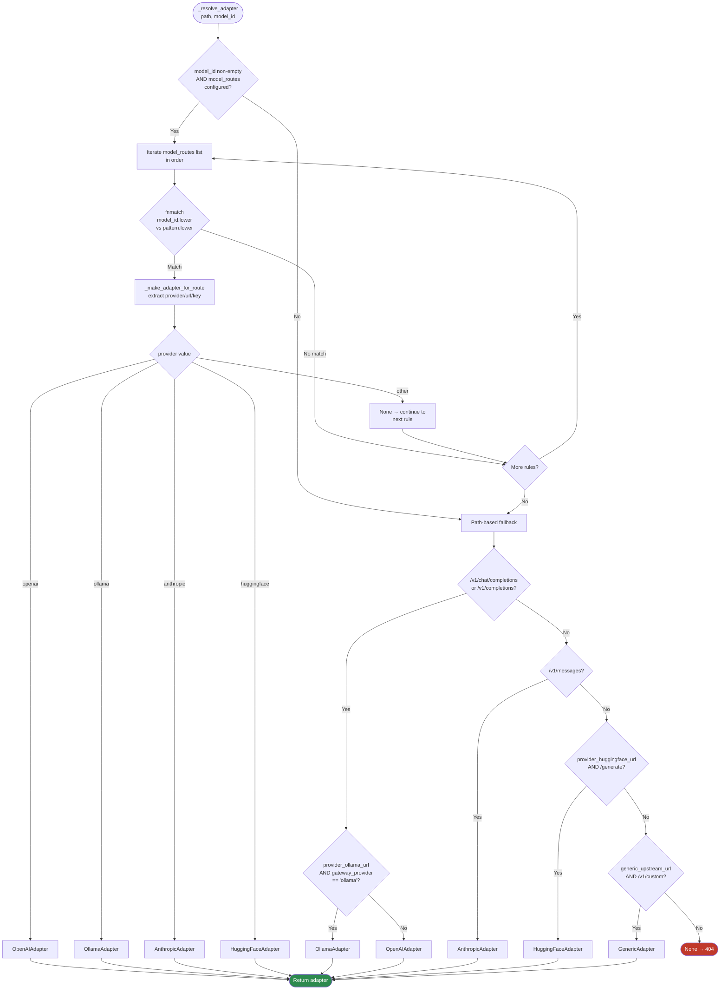
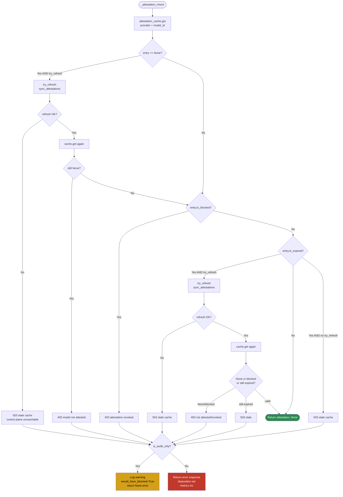
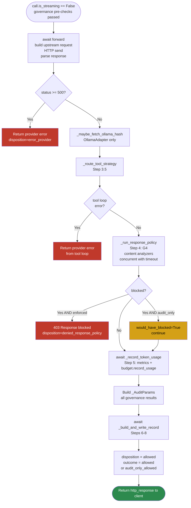
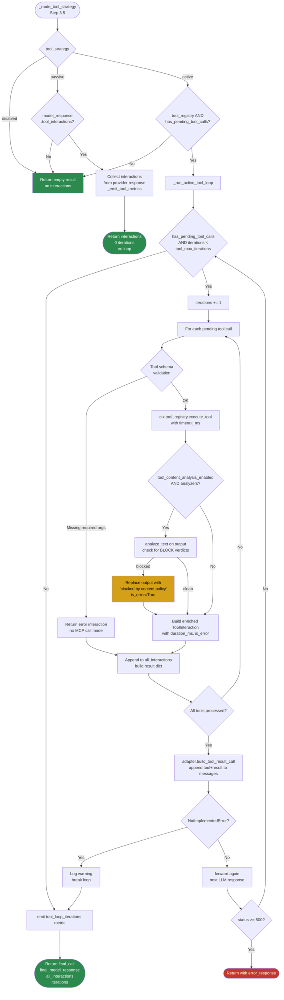
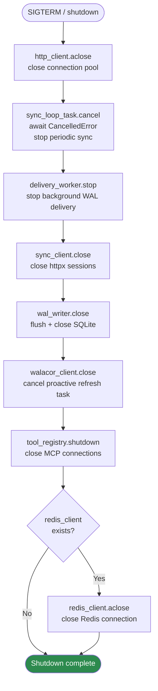

# Gateway — Flow Diagrams & Soundness Analysis

**Audience:** Engineering team
**Generated against:** Phase 23 codebase (Redis + multi-model routing + lineage dashboard + embedded control plane + JWT/SSO + adaptive gateway)

---

## Contents

1. [Scenario Map](#1-scenario-map)
2. [Middleware Stack](#2-middleware-stack)
3. [Startup Initialization](#3-startup-initialization)
4. [Top-Level Request Pipeline](#4-top-level-request-pipeline)
5. [Adapter Resolution — Model Routing](#5-adapter-resolution--model-routing)
6. [Governance Pre-checks (Steps 1–2.7)](#6-governance-pre-checks-steps-12-7)
7. [Attestation Check](#7-attestation-check)
8. [Budget Check — In-Memory vs Redis](#8-budget-check--in-memory-vs-redis)
9. [Streaming vs Non-Streaming Paths](#9-streaming-vs-non-streaming-paths)
10. [Tool Strategy Router](#10-tool-strategy-router)
11. [Post-Inference: Policy + Record Writing](#11-post-inference-policy--record-writing)
12. [Session Chain — In-Memory vs Redis](#12-session-chain--in-memory-vs-redis)
13. [Completeness Middleware](#13-completeness-middleware)
14. [Shutdown](#14-shutdown)
15. [Soundness Analysis](#15-soundness-analysis)

---

## 1. Scenario Map

Every request falls into exactly one of these execution paths:

```
┌──────────────────────────────────────────────────────────────────────┐
│                       ALL REQUEST SCENARIOS                          │
│                                                                      │
│  ┌──────────────────────────────────┐                                │
│  │  A. SKIP GOVERNANCE (proxy mode) │                                │
│  │                                  │                                │
│  │  A1. Non-streaming               │  ← Walacor write if creds set  │
│  │  A2. Streaming                   │  ← BackgroundTask write        │
│  └──────────────────────────────────┘                                │
│                                                                      │
│  ┌──────────────────────────────────────────────────────────────┐    │
│  │  B. FULL GOVERNANCE (enforced or audit_only)                  │    │
│  │                                                               │    │
│  │  B1. Non-streaming, no tools                                  │    │
│  │  B2. Non-streaming, passive tool strategy                     │    │
│  │  B3. Non-streaming, active tool strategy (loop)               │    │
│  │  B4. Streaming (tools captured post-stream; no active loop)   │    │
│  │                                                               │    │
│  │  ↑ Each above × enforced | audit_only mode                    │    │
│  └──────────────────────────────────────────────────────────────┘    │
│                                                                      │
│  ┌──────────────────────────────────────────────────────────────┐    │
│  │  C. ERROR PATHS (return before forwarding)                    │    │
│  │                                                               │    │
│  │  C1. 405 method not allowed                                   │    │
│  │  C2. 404 no adapter for path/model                            │    │
│  │  C3. 400 request body parse error                             │    │
│  │  C4. 503 attestation cache not configured                     │    │
│  │  C5. 403/503 attestation failure                              │    │
│  │  C6. 403/503 pre-policy failure                               │    │
│  │  C7. 503 WAL backpressure                                     │    │
│  │  C8. 429 budget exhausted                                     │    │
│  │  C9. 5xx provider error (post-forward)                        │    │
│  │  C10. 403 post-inference content block                        │    │
│  └──────────────────────────────────────────────────────────────┘    │
└──────────────────────────────────────────────────────────────────────┘
```

---

## 2. Middleware Stack

Middleware layers execute in outermost-first order (Starlette: last registered = outermost):

```
Incoming Request
       │
       ▼
┌─────────────────────────────────────────────┐  ← OUTERMOST
│  cors_middleware                             │
│  • OPTIONS → return 200 immediately          │
│  • Other → add CORS headers to response      │
└──────────────────────┬──────────────────────┘
                       │
                       ▼
┌─────────────────────────────────────────────┐
│  api_key_middleware                          │
│  • /health, /metrics → skip auth            │
│  • keys configured? → check Bearer/X-API-Key│
│  • Invalid → 401, disposition=denied_auth   │
└──────────────────────┬──────────────────────┘
                       │
                       ▼
┌─────────────────────────────────────────────┐
│  completeness_middleware                     │
│  • new_request_id() called here (always)     │
│  • ALWAYS writes gateway_attempts in finally │
│  • Reads request.state (ContextVar fallback) │
└──────────────────────┬──────────────────────┘
                       │
                       ▼
               Route Handler
               (orchestrator)
```

---

## 3. Startup Initialization

```mermaid
flowchart TD
    START([walacor-gateway start]) --> SETTINGS[Load Settings\nenvironment / .env.gateway]
    SETTINGS --> WALACOR{walacor_storage_enabled?\nserver+user+pass all set}

    WALACOR -- Yes --> INIT_WALACOR[_init_walacor\nWalacorClient.start\nJWT auth + token refresh loop]
    WALACOR -- No --> SKIP_GOV_CHECK

    INIT_WALACOR --> SKIP_GOV_CHECK

    SKIP_GOV_CHECK{skip_governance?} -- Yes --> SET_PROXY[ctx.skip_governance = True\nno http_client\nno cache/WAL\nno redis/budget/session]
    SET_PROXY --> SELFTEST_PROXY[_self_test\nhash check only]
    SELFTEST_PROXY --> READY([Gateway Ready\nTransparent Proxy Mode])

    SKIP_GOV_CHECK -- No --> GOVERNANCE[_init_governance\nAttestationCache\nPolicyCache\nSyncClient\nstartup_sync]
    GOVERNANCE --> WAL_NEEDED{walacor_storage_enabled?}
    WAL_NEEDED -- No --> INIT_WAL[_init_wal\nWALWriter + DeliveryWorker\nmkdir WAL path]
    WAL_NEEDED -- Yes --> HTTP_CLIENT

    INIT_WAL --> HTTP_CLIENT[httpx.AsyncClient\ntimeout 60s\nhttp2 + keepalive pool]
    HTTP_CLIENT --> REDIS{WALACOR_REDIS_URL set?}
    REDIS -- Yes --> INIT_REDIS[redis.asyncio.from_url\nping - fail fast\nReturn redis_client]
    REDIS -- No --> ANALYZERS[redis_client = None]
    INIT_REDIS --> ANALYZERS

    ANALYZERS[_init_content_analyzers\nPIIDetector if enabled\nToxicityDetector if enabled]
    ANALYZERS --> BUDGET[_init_budget_tracker\nmake_budget_tracker\nredis_client or in-memory]
    BUDGET --> BUDGET_CONFIGURE{budget enabled AND\nmax_tokens > 0?}
    BUDGET_CONFIGURE -- Yes AND redis_client is None --> CONFIGURE[tracker.configure\ntenant budget set\nfor in-memory only]
    BUDGET_CONFIGURE -- No OR redis set --> SESSION
    CONFIGURE --> SESSION

    SESSION[_init_session_chain\nmake_session_chain_tracker\nredis_client or in-memory]
    SESSION --> TOOL_ENABLED{tool_aware_enabled\nAND mcp_servers_json?}
    TOOL_ENABLED -- Yes --> INIT_TOOLS[_init_tool_registry\nparse MCP configs\nToolRegistry.startup]
    TOOL_ENABLED -- No --> SELFTEST

    INIT_TOOLS --> SELFTEST[_self_test\nhash self-test\nURL scheme check\nWAL write+deliver test]
    SELFTEST --> SYNC_LOOP[asyncio.create_task\n_run_sync_loop\npull sync every 60s]
    SYNC_LOOP --> READY_FULL([Gateway Ready\nFull Governance Mode])

    style READY fill:#2d8a4e,color:#fff
    style READY_FULL fill:#2d8a4e,color:#fff
    style INIT_REDIS fill:#d4a017,color:#000
    style INIT_WALACOR fill:#1a6fa8,color:#fff
```



---

## 4. Top-Level Request Pipeline



---

## 5. Adapter Resolution — Model Routing



---

## 6. Governance Pre-checks (Steps 1–2.7)

```mermaid
flowchart TD
    START([_run_pre_checks]) --> ATT_CACHE{ctx.attestation_cache\nexists?}
    ATT_CACHE -- No --> E503A[503 Attestation cache\nnot configured]

    ATT_CACHE -- Yes --> ATTEST[Step 1: _attestation_check\nresolve_attestation\nwith try_refresh]
    ATTEST --> ATT_ERR{err returned?}
    ATT_ERR -- Yes --> AUDIT1{is_audit_only?}
    AUDIT1 -- Yes --> FLAG_ATT[Set would_have_blocked=true\nreason='attestation'\ncontinue]
    AUDIT1 -- No --> E_ATT[Return 403/503\ndisposition=denied_attestation]

    ATT_ERR -- No --> POL_CACHE{ctx.policy_cache\nexists?}
    FLAG_ATT --> POL_CACHE

    POL_CACHE -- No --> E503B[503 Policy cache\nnot configured]
    POL_CACHE -- Yes --> POLICY[Step 2: _pre_policy_check\nevaluate_pre_inference\ncheck stale + evaluate]

    POLICY --> POL_ERR{err returned?}
    POL_ERR -- Yes --> AUDIT2{is_audit_only?}
    AUDIT2 -- Yes --> FLAG_POL[Set would_have_blocked=true\nreason='policy'\ncontinue]
    AUDIT2 -- No --> E_POL[Return 403/503\ndisposition=denied_policy]

    POL_ERR -- No --> WAL_SKIP{is_audit_only?}
    FLAG_POL --> WAL_SKIP

    WAL_SKIP -- Yes --> SKIP_WAL[Skip WAL check\naudit_only always allows]
    WAL_SKIP -- No --> WAL[Step 2.5: _wal_backpressure_check\npending >= high_water_mark\nOR disk >= max_size_gb]

    WAL --> WAL_ERR{WAL at capacity?}
    WAL_ERR -- Yes --> E503C[503 WAL retention exhausted\ndisposition=denied_wal_full]
    WAL_ERR -- No --> BUDGET_STEP
    SKIP_WAL --> BUDGET_STEP

    BUDGET_STEP[Step 2.6: _budget_check\nawait check_and_reserve]
    BUDGET_STEP --> BUD_ERR{err returned?}
    BUD_ERR -- Yes --> AUDIT3{is_audit_only?}
    AUDIT3 -- Yes --> FLAG_BUD[Set would_have_blocked=true\nreason='budget'\ncontinue]
    AUDIT3 -- No --> E429[429 Token budget exhausted\ndisposition=denied_budget]

    BUD_ERR -- No --> TOOL_STRAT
    FLAG_BUD --> TOOL_STRAT

    TOOL_STRAT[Step 2.7: _select_tool_strategy\n'passive' / 'active' / 'disabled']
    TOOL_STRAT --> ACTIVE_INJECT{strategy=='active'\nAND tool_registry\nhas tools?}
    ACTIVE_INJECT -- Yes --> INJECT[_inject_tools_into_call\nadd MCP tool defs\nto request body]
    ACTIVE_INJECT -- No --> BUILD_RESULT
    INJECT --> BUILD_RESULT

    BUILD_RESULT[Build _PreCheckResult\natt_id, pv, pr\nbudget_rem, call\naudit_metadata]
    BUILD_RESULT --> DONE([Return _PreCheckResult\nerror=None])

    style DONE fill:#2d8a4e,color:#fff
    style E503A fill:#c0392b,color:#fff
    style E503B fill:#c0392b,color:#fff
    style E503C fill:#c0392b,color:#fff
    style E_ATT fill:#c0392b,color:#fff
    style E_POL fill:#c0392b,color:#fff
    style E429 fill:#c0392b,color:#fff
    style FLAG_ATT fill:#d4a017,color:#000
    style FLAG_POL fill:#d4a017,color:#000
    style FLAG_BUD fill:#d4a017,color:#000
```



---

## 7. Attestation Check



---

## 8. Budget Check — In-Memory vs Redis

```mermaid
flowchart TD
    START([_budget_check]) --> ENABLED{budget_tracker\nAND token_budget_enabled?}
    ENABLED -- No --> PASS_THROUGH[Return None, whb, reason, None\nbudget not enforced]

    ENABLED -- Yes --> ESTIMATE[estimated = max\nlen prompt_text // 4, 1]
    ESTIMATE --> TRACKER{Which tracker?}

    TRACKER -- In-Memory --> IM_CHECK[acquire threading.Lock\nget state by tenant+user]
    IM_CHECK --> IM_STATE{state exists?}
    IM_STATE -- No --> IM_UNLIMITED[Return True, -1\nunlimited - no budget set]
    IM_STATE -- Yes --> IM_EXPIRED{period expired?}
    IM_EXPIRED -- Yes --> IM_RESET[Reset tokens_used = 0\nupdate period_start]
    IM_EXPIRED -- No --> IM_MAX
    IM_RESET --> IM_MAX

    IM_MAX{max_tokens == 0?}
    IM_MAX -- Yes --> IM_UNLIMITED2[Return True, -1\nunlimited]
    IM_MAX -- No --> IM_REMAINING[remaining = max_tokens - tokens_used]
    IM_REMAINING --> IM_ZERO{remaining <= 0?}
    IM_ZERO -- Yes --> IM_DENY[Return False, 0]
    IM_ZERO -- No --> IM_ALLOW[Return True, remaining\nNOTE: tokens_used NOT\nupdated here - only in\nrecord_usage later]

    TRACKER -- Redis --> REDIS_KEY[_period_key\ngateway:budget:tenant:user:YYYYMM\nor YYYYMMDD\ncalculate TTL to period end]
    REDIS_KEY --> REDIS_LUA[eval Lua script\nKEYS\[1\]=key\nARGV\[1\]=max_tokens\nARGV\[2\]=estimated\nARGV\[3\]=ttl]
    REDIS_LUA --> LUA_RESULT{Lua returns\n\[allowed, remaining\]}
    LUA_RESULT -- allowed=0 --> REDIS_DENY[Return False, remaining]
    LUA_RESULT -- allowed=1 --> REDIS_ALLOW[Return True, remaining\nNOTE: key already\nincremented by estimated]

    IM_DENY --> BLOCK_LOGIC
    REDIS_DENY --> BLOCK_LOGIC

    BLOCK_LOGIC{allowed==False}
    BLOCK_LOGIC --> AUDIT{is_audit_only?}
    AUDIT -- Yes --> SOFT[Return budget_rem\nwould_have_blocked=True\nreason='budget'\nerr=None]
    AUDIT -- No --> HARD[429 Token budget exhausted\ndisposition=denied_budget\nmetrics: budget_exceeded_total]

    IM_ALLOW --> DONE([Return budget_rem, whb,\nreason, err=None])
    REDIS_ALLOW --> DONE
    IM_UNLIMITED --> DONE
    IM_UNLIMITED2 --> DONE
    PASS_THROUGH --> DONE

    style DONE fill:#2d8a4e,color:#fff
    style SOFT fill:#d4a017,color:#000
    style HARD fill:#c0392b,color:#fff
    style IM_ALLOW fill:#1a6fa8,color:#fff
    style REDIS_ALLOW fill:#d4a017,color:#000
```

---

## 9. Streaming vs Non-Streaming Paths

### 9A — Streaming Path

```mermaid
flowchart TD
    STREAM_IN([call.is_streaming == True\ngovernance pre-checks passed]) --> SET_ALLOWED[disposition = allowed]
    SET_ALLOWED --> CREATE_BUF[Create buffer list\nbytes accumulator]
    CREATE_BUF --> BG_TASK[BackgroundTask\n_after_stream_record\nwill run after stream ends]
    BG_TASK --> STREAM_TEE[stream_with_tee\nbuild upstream request\nadd X-Walacor-Prompt-ID header\nopen HTTP/2 stream]
    STREAM_TEE --> YIELD_LOOP[Yield each chunk\nto client immediately\nbuffer while size < max_stream_buffer_bytes]
    YIELD_LOOP --> STREAM_DONE[Stream complete\nforward_duration metric recorded]
    STREAM_DONE --> RETURN_RESP[Return StreamingResponse\nwith BackgroundTask attached]
    RETURN_RESP --> CLIENT([Chunks delivered to client\nin real-time])
    RETURN_RESP --> BG_EXEC

    BG_EXEC[BackgroundTask executes\n_after_stream_record]
    BG_EXEC --> PARSE_BUF[adapter.parse_streamed_response\nfrom accumulated buffer]
    PARSE_BUF --> OLLAMA_CHECK{OllamaAdapter?}
    OLLAMA_CHECK -- Yes --> FETCH_HASH[fetch_model_hash\nGET /api/show\ncached per model]
    OLLAMA_CHECK -- No --> TOKEN_USAGE
    FETCH_HASH --> TOKEN_USAGE

    TOKEN_USAGE[await _record_token_usage\nPrometheus metrics\nbudget_tracker.record_usage\nno-op for Redis tracker]
    TOKEN_USAGE --> STREAM_POLICY[_eval_post_stream_policy\nrun content analyzers\non assembled response]
    STREAM_POLICY --> PASSIVE_TOOLS{model_response\nhas tool_interactions?}
    PASSIVE_TOOLS -- Yes --> CAPTURE_TOOLS[_build_tool_audit_metadata\n'passive' strategy\ntool_interactions from provider]
    PASSIVE_TOOLS -- No --> BUILD_REC
    CAPTURE_TOOLS --> BUILD_REC

    BUILD_REC[build_execution_record\nall fields assembled]
    BUILD_REC --> CHAIN[await _apply_session_chain\ncompute + attach seq/hash]
    CHAIN --> STORE{walacor_client?}
    STORE -- Yes --> WAL_WRITE[walacor_client\n.write_execution]
    STORE -- No --> LOCAL_WRITE[wal_writer\n.write_durable]
    WAL_WRITE --> TOOL_EVENTS
    LOCAL_WRITE --> TOOL_EVENTS

    TOOL_EVENTS[_write_tool_events\nfor each tool interaction:\n- build record\n- content analyze output\n- write to Walacor or WAL]
    TOOL_EVENTS --> UPDATE_CHAIN[await session_chain.update\nstore seq + hash in\nmemory or Redis]
    UPDATE_CHAIN --> BG_DONE([BackgroundTask complete])

    style CLIENT fill:#2d8a4e,color:#fff
    style BG_DONE fill:#2d8a4e,color:#fff
```



### 9B — Non-Streaming Path



---

## 10. Tool Strategy Router



---

## 11. Post-Inference: Policy + Record Writing

```mermaid
flowchart TD
    START([_build_and_write_record\nSteps 6-8]) --> SESSION_ID[Extract session_id\nfrom call.metadata]
    SESSION_ID --> TOOL_META[_build_tool_audit_metadata\ntool_strategy, interactions, iterations]
    TOOL_META --> BUILD_REC[build_execution_record\nexecution_id, prompt_text\nresponse_content, hashes\nprovider_request_id, model_hash\npolicy fields, tenant, session\nall metadata merged]

    BUILD_REC --> CHAIN{session_id AND\nsession_chain AND\nsession_chain_enabled?}

    CHAIN -- No --> SKIP_CHAIN[No chain fields\nsequence_number not set]
    CHAIN -- Yes --> APPLY_CHAIN[await _apply_session_chain]

    APPLY_CHAIN --> GET_NEXT[await session_chain\n.next_chain_values\nsession_id]
    GET_NEXT --> ATTACH[record.sequence_number = seq_num\nrecord.previous_record_id = prev_record_id\nrecord.record_id = UUIDv7 from hasher]

    SKIP_CHAIN --> STORE
    ATTACH --> STORE

    STORE{walacor_client?}
    STORE -- Yes --> WALACOR_WRITE[await walacor_client\n.write_execution\nPOST /envelopes/submit\nJWT bearer auth]
    STORE -- No --> WAL_WRITE[wal_writer\n.write_durable\nSQLite WAL mode\nsynchronous=NORMAL (durable)]

    WALACOR_WRITE --> SET_EXEC_ID[execution_id_var.set\nrequest.state.walacor_execution_id\nfor completeness middleware]
    WAL_WRITE --> SET_EXEC_ID

    SET_EXEC_ID --> TOOL_EVENTS[_write_tool_events\nfor each ToolInteraction]

    TOOL_EVENTS --> TOOL_LOOP[For each interaction:\nbuild first-class tool event record\noptional content analysis on output\nwrite to Walacor or WAL]
    TOOL_LOOP --> CHAIN_UPDATE{session_id AND\nsession_chain AND\napply_chain returned True?}

    CHAIN_UPDATE -- No --> DONE
    CHAIN_UPDATE -- Yes --> UPDATE[await session_chain.update\nsession_id, seq_num, record_id\nfor in-memory: update dict\nfor Redis: HSET record_id + EXPIRE]
    UPDATE --> DONE([Record committed])

    style DONE fill:#2d8a4e,color:#fff
    style WALACOR_WRITE fill:#1a6fa8,color:#fff
    style WAL_WRITE fill:#1a6fa8,color:#fff
```

---

## 12. Session Chain — In-Memory vs Redis

```mermaid
flowchart TD
    START([next_chain_values\nsession_id]) --> WHICH{Which tracker?}

    WHICH -- In-Memory --> IM_LOCK[Acquire threading.Lock]
    IM_LOCK --> IM_LOOKUP{state in _sessions?}
    IM_LOOKUP -- No --> IM_GENESIS[Return ChainValues\nseq=0, prev_record_id=None]
    IM_LOOKUP -- Yes --> IM_RETURN[Return ChainValues\nseq+1, state.last_record_id]

    WHICH -- Redis --> REDIS_KEY[key = gateway:session:session_id]
    REDIS_KEY --> REDIS_PIPE[Open MULTI transaction pipeline]
    REDIS_PIPE --> HINCRBY[HINCRBY key 'seq' 1\natomic increment\nreturns NEW value]
    HINCRBY --> HGET[HGET key 'record_id'\nreturns current id\nBEFORE this call's update]
    HGET --> EXPIRE[EXPIRE key ttl]
    EXPIRE --> EXEC_PIPE[Execute pipeline atomically]
    EXEC_PIPE --> SEQ_RESULT[seq_num = int returned\nfrom HINCRBY]
    SEQ_RESULT --> ID_RESULT{record_id returned\nfrom HGET?}
    ID_RESULT -- No data\nfirst call --> REDIS_GENESIS[Return ChainValues\nseq=1, prev_record_id=None]
    ID_RESULT -- Has data --> REDIS_RETURN[Return ChainValues\nseq=HINCRBY result\nprev_record_id=decoded string]

    IM_RETURN --> AFTER_NEXT
    REDIS_RETURN --> AFTER_NEXT
    IM_GENESIS --> AFTER_NEXT
    REDIS_GENESIS --> AFTER_NEXT

    AFTER_NEXT([ChainValues returned to caller\nseq_num and prev_record_id]) --> WHICH2{Which tracker\nfor update?}

    WHICH2 -- In-Memory --> IM_UPDATE[sessions\[session_id\] = SessionState\nseq=n, last_record_id=record_id\nevict if over max_sessions]
    WHICH2 -- Redis --> REDIS_UPDATE[Open MULTI pipeline\nHSET key 'record_id' record_id\nEXPIRE key ttl\nExecute]

    IM_UPDATE --> DONE([Chain updated])
    REDIS_UPDATE --> DONE

    style DONE fill:#2d8a4e,color:#fff
    style NOTE1 fill:#d4a017,color:#000
    style NOTE2 fill:#c0392b,color:#fff
```

---

## 13. Completeness Middleware

```mermaid
flowchart TD
    START([Every request\nincluding /health /metrics]) --> NEW_RID[new_request_id\ngenerate UUID\nreset all ContextVars\ndisposition=error_gateway]
    NEW_RID --> TRY[Try: call_next\npass through all middleware\nand handler]
    TRY --> HANDLER{Handler returns\nor raises?}
    HANDLER -- Returns --> STORE_RESP[response = returned Response]
    HANDLER -- Raises --> NO_RESP[response = None\nstatus_code = 500]
    STORE_RESP --> FINALLY
    NO_RESP --> FINALLY

    FINALLY[Finally block: ALWAYS executes] --> ENABLED{completeness_enabled\nAND\nwal_writer or walacor_client?}

    ENABLED -- No --> RETURN[Return response]

    ENABLED -- Yes --> EXTRACT[Extract from request.state first\nthen ContextVar fallback:\ndisposition\nstatus_code\ntenant_id\nprovider\nmodel_id\nexecution_id]

    EXTRACT --> WRITE{walacor_client?}
    WRITE -- Yes --> WALACOR_ATT[await walacor_client.write_attempt\nrequest_id, tenant, path\ndisposition, status_code\nprovider, model_id, execution_id]
    WRITE -- No --> WAL_ATT[wal_writer.write_attempt\nsame fields to SQLite]

    WALACOR_ATT --> METRIC[gateway_attempts_total\n.labels\(disposition\).inc]
    WAL_ATT --> METRIC
    METRIC --> RETURN

    RETURN --> RESP([Response to caller])

    note1[NOTE: BaseHTTPMiddleware runs call_next\nin a separate anyio task — ContextVar\nmutations in handler NOT visible here.\nSolution: read request.state FIRST]

    style RESP fill:#2d8a4e,color:#fff
    style FINALLY fill:#1a6fa8,color:#fff
    style note1 fill:#f0f0f0,color:#333
```

---

## 14. Shutdown



---

## 15. Soundness Analysis

Each finding is graded: **CRITICAL** / **HIGH** / **MEDIUM** / **LOW** / **OK**.

> **Status: All 9 findings resolved.** See the Summary Table below.

---

### FINDING 1 — ~~CRITICAL~~ FIXED: Redis session sequence starts at 1, in-memory starts at 0

| | |
|---|---|
| **File** | `session_chain.py` — `RedisSessionChainTracker` |
| **Was** | `next_chain_values` called `HINCRBY seq 1` (Redis initializes to 0, then increments to 1). First record got seq=1 from Redis but seq=0 from in-memory. |
| **Fix applied** | `next_chain_values` is now **read-only** — calls `HGET seq` (returns `None` for a new session → `last_seq=-1` → `next_seq=0`). `update()` atomically writes both `seq` and `hash` via HSET in a single pipeline. First Redis record now correctly returns seq=0, matching in-memory. |

---

### FINDING 2 — ~~HIGH~~ FIXED: In-memory budget tracker allows concurrent over-spend

| | |
|---|---|
| **File** | `budget_tracker.py` — `BudgetTracker.check_and_reserve` |
| **Was** | `check_and_reserve` read `remaining` but did not update `tokens_used`. Two concurrent async requests could both see the same balance and both pass. |
| **Fix applied** | `check_and_reserve` now deducts `estimated_tokens` from `tokens_used` immediately inside the lock. `record_usage` accepts an `estimated: int = 0` parameter and applies only the delta `(actual - estimated)` to correct over/under-reservations. |

---

### FINDING 3 — ~~HIGH~~ FIXED: Redis session chain has a seq-without-hash hole on write failure

| | |
|---|---|
| **File** | `session_chain.py` — `RedisSessionChainTracker` |
| **Was** | `HINCRBY` fired in `next_chain_values`. If `update()` was never reached (e.g., Walacor write error), the counter had already advanced, creating a sequence gap. |
| **Fix applied** | `next_chain_values` is now purely read-only (see Finding 1 fix). `update()` writes both `seq` and `hash` atomically. If a write fails before `update()` is called, no seq increment has occurred — the counter is unchanged and the next successful write gets the correct seq. |

---

### FINDING 4 — ~~HIGH~~ FIXED: Redis budget tracker uses estimated tokens, never corrects with actual usage

| | |
|---|---|
| **File** | `budget_tracker.py` — `RedisBudgetTracker.record_usage`; `orchestrator.py` |
| **Was** | `record_usage` was a no-op. Redis counter only held estimated prompt tokens; completion tokens were never accounted for. |
| **Fix applied** | `record_usage(actual, estimated=0)` now applies `delta = actual - estimated` via `INCRBY`/`DECRBY`. The `estimated` value is threaded from `_budget_check` → `_PreCheckResult.budget_estimated` → `_record_token_usage(estimated=...)` → `budget_tracker.record_usage(estimated=...)` in both the streaming and non-streaming paths. |

---

### FINDING 5 — ~~MEDIUM~~ FIXED: `model_routes` property parses JSON on every call

| | |
|---|---|
| **File** | `config.py` — `Settings.model_routes` |
| **Was** | `@property model_routes` called `json.loads` on every request. |
| **Fix applied** | Added `_parsed_model_routes: list[dict] = PrivateAttr(default_factory=list)` and a `@model_validator(mode='after')` that parses `model_routing_json` once at `Settings` construction time. `model_routes` property now just returns `self._parsed_model_routes`. Since `get_settings()` is `@lru_cache`, parsing happens once per process lifetime. |

---

### FINDING 6 — ~~MEDIUM~~ FIXED: `stream_with_tee` always returns `status_code=200`

| | |
|---|---|
| **File** | `forwarder.py` — `stream_with_tee` |
| **Was** | `StreamingResponse(status_code=200)` hardcoded. Provider 429/503 errors were delivered as 200 OK with SSE content-type. |
| **Fix applied** | The upstream connection is now opened eagerly *before* building `StreamingResponse` using `upstream_ctx.__aenter__()`. The actual `upstream.status_code` is captured and passed to `StreamingResponse(status_code=actual_status)`. The generator iterates over the already-open upstream and closes it in `finally`. One-off clients (skip-governance path) now own a dedicated `AsyncClient` kept alive for the stream duration, closed in the generator's `finally` block. |

---

### FINDING 7 — ~~MEDIUM~~ FIXED: Skip-governance mode leaves `http_client = None`, creating per-request connections

| | |
|---|---|
| **File** | `main.py` — `on_startup` |
| **Was** | `ctx.http_client` was initialized after the `if settings.skip_governance: return` early exit, so skip-governance mode had no shared client. Each request created a new one-off `httpx.AsyncClient`. |
| **Fix applied** | `ctx.http_client` is now initialized *before* the `skip_governance` early return. Both modes share the same connection-pooled client (200 max connections, HTTP/2, keepalive). |

---

### FINDING 8 — ~~LOW~~ FIXED: `active_session_count()` returns -1 for Redis tracker

| | |
|---|---|
| **File** | `health.py` — `/health` and `/metrics` endpoints |
| **Was** | Health showed `"active_sessions": -1` when Redis tracker is used. Prometheus gauge was set to -1. |
| **Fix applied** | Health endpoint shows `"active_sessions": "unavailable"` when the value is negative (Redis sentinel). Prometheus gauge is only updated when the value is ≥ 0 — with Redis, the gauge keeps its last known value rather than being set to -1. |

---

### FINDING 9 — ~~LOW~~ FIXED: `_after_stream_record` swallows all exceptions silently

| | |
|---|---|
| **File** | `orchestrator.py` — `_after_stream_record` |
| **Was** | `except Exception as e: logger.error("...: %s", e)` — no stack trace logged. Write failures were invisible in structured log analysis. |
| **Fix applied** | Changed to `logger.error("...: %s", e, exc_info=True)` — full traceback is now included in the log record, enabling structured log search by exception type and traceback line. |

---

### Summary Table

| # | Severity | Component | Description | Status |
|---|---|---|---|---|
| 1 | **CRITICAL** | `session_chain.py` | Redis seq starts at 1; in-memory starts at 0 | ✅ Fixed |
| 2 | **HIGH** | `budget_tracker.py` | In-memory `check_and_reserve` doesn't reserve → concurrent over-spend | ✅ Fixed |
| 3 | **HIGH** | `session_chain.py` | Redis HINCRBY before write: seq gap on write failure | ✅ Fixed |
| 4 | **HIGH** | `budget_tracker.py` + `orchestrator.py` | Redis `record_usage` no-op → budget underestimates usage | ✅ Fixed |
| 5 | **MEDIUM** | `config.py` | `model_routes` re-parses JSON on every request | ✅ Fixed |
| 6 | **MEDIUM** | `forwarder.py` | Streaming response hardcoded `status_code=200` | ✅ Fixed |
| 7 | **MEDIUM** | `main.py` | Skip-governance creates new HTTP connection per request | ✅ Fixed |
| 8 | **LOW** | `health.py` | Redis tracker returns `-1` for `active_session_count` | ✅ Fixed |
| 9 | **LOW** | `orchestrator.py` | `_after_stream_record` swallows exceptions without traceback | ✅ Fixed |

---

### What is Sound ✓

The following design decisions are correct:

| Area | Why it's sound |
|---|---|
| **`_peek_model_id` + double body read** | Starlette caches `request.body()` → safe to call before and after adapter parse |
| **Completeness middleware reads `request.state` first** | Correct solution to the BaseHTTPMiddleware cross-task ContextVar boundary problem |
| **Redis Lua script for check-and-reserve** | Atomic — eliminates the concurrent over-spend issue that the in-memory tracker has |
| **Redis pipeline with `transaction=True`** | Both `next_chain_values` (read-only) and `update` (write-both-seq-and-hash) use MULTI/EXEC — correct isolation |
| **Forwarder shared vs one-off client** | Correctly detects `shared = client is ctx.http_client`; both modes now use a pooled client (Finding 7 fix) |
| **Tool loop active strategy forces `stream=False`** | Required — gateway must intercept full response to detect tool calls before returning to client |
| **`make_session_chain_tracker` / `make_budget_tracker` factories** | Clean separation — in-memory and Redis share the same async interface, callers unchanged |
| **fail-fast `ping()` on Redis startup** | Correct — better to fail at startup than discover Redis unreachable on first production request |
| **`try_refresh` closure in attestation** | Avoids passing sync_client around; lazy refresh only on cache miss/expiry |
| **Session chain TTL refreshed on every access** | EXPIRE called in both `next_chain_values` and `update` pipelines — TTL is sliding, not fixed |
| **`budget_estimated` threaded to `record_usage`** | Pre-reserved token count is now passed from `_budget_check` → `_PreCheckResult` → `_record_token_usage` → `record_usage(estimated=...)` so actual usage correction is precise in both in-memory and Redis trackers |
| **`stream_with_tee` opens stream eagerly** | Upstream connection is opened before `StreamingResponse` is created, so the actual HTTP status is captured and propagated |
